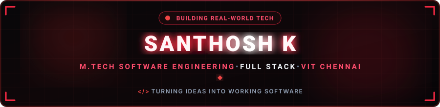
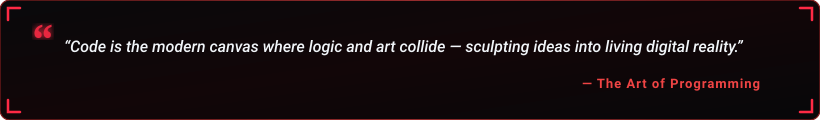

  

  

  
  &nbsp;
  
  &nbsp;
  

---

<h2 align="center">🔴 About Me</h2>

  

  

  Hey! I'm <b>Santhosh K</b>, a passionate <b>Integrated M.Tech Software Engineering student & developer @ VIT Chennai</b> based in India. 
  Software enthusiast and aspiring full-stack developer focused on building, learning and open to exciting collaboration.

  
  &nbsp;
  
  &nbsp;
  

  💬 <b>Let's Discuss:</b> Python, C, C++, Java, JavaScript, React, HTML, CSS & Git Workflows. 
  ⚡ <b>Philosophy:</b> <i>"I love turning ideas into working software!"</i>

<table width="100%" border="0" align="center">
<tr>
<td width="50%" align="center" style="padding: 14px;">
  <h4>🔭 Flagship Project</h4>
  
<a href="https://github.com/santhosh-k7/Hotel-Management" target="_blank"><b>Hotel-Management</b></a> Python Tkinter Booking App

</td>
<td width="50%" align="center" style="padding: 14px;">
  <h4>🌱 Active Deep Dives</h4>
  
<b>DSA &amp; Full-Stack</b> React Ecosystem &amp; Learning

</td>
</tr>
<tr>
<td width="50%" align="center" style="padding: 14px;">
  <h4>🎓 Education</h4>
  
<b>VIT Chennai</b> Integrated M.Tech Software Engineering

</td>
<td width="50%" align="center" style="padding: 14px;">
  <h4>🤝 Collaboration</h4>
  
<b>Web &amp; Full-Stack</b> Open to exciting new projects

</td>
</tr>
</table>

---

<h2 align="center">🔴 Featured Project Spotlight</h2>

<table width="100%" border="0" align="center">
<tr>
<td align="center" style="padding: 22px;">
  <h3>🏨 Hotel-Management</h3>
  
<i>A Tkinter-based hotel booking application featuring user registration, room booking, payment simulation and feedback functionality.</i>

   
  

    
  

  
Also check: <a href="https://github.com/santhosh-k7/AI-Mood-Playlist-Generator" target="_blank"><b>AI-Mood-Playlist-Generator</b></a> (JavaScript) • <a href="https://github.com/santhosh-k7/About-Me" target="_blank"><b>About-Me</b></a>

</td>
</tr>
</table>

---

<h2 align="center">🧩 LeetCode</h2>

  

---

<h2 align="center">🛠️ Tech Stack & Skills</h2>

<b>Core Programming Languages</b>

  

<b>Frontend Development</b>

  

<b>Tools & Workflow</b>

  

---

<h2 align="center">📊 GitHub Analytics & Activity</h2>

  
  &nbsp;&nbsp;
  

  

---

<h2 align="center">📬 Let's Connect</h2>

<i>Open to collaboration, internships and full-stack projects — just say hello!</i>

<table border="0" align="center">
<tr>
<td align="center" width="220" style="padding: 16px;">
  <a href="https://github.com/santhosh-k7" target="_blank">
    
      
    
  </a>
   
  <b>Follow My Work</b>
</td>
<td align="center" width="220" style="padding: 16px;">
  <a href="https://www.linkedin.com/in/santhosh-k7/" target="_blank">
    
      
    
  </a>
   
  <b>Professional Network</b>
</td>
<td align="center" width="220" style="padding: 16px;">
  <a href="https://leetcode.com/u/Santhoshk_/" target="_blank">
    
      
    
  </a>
   
  <b>DSA Practice</b>
</td>
</tr>
</table>

  

